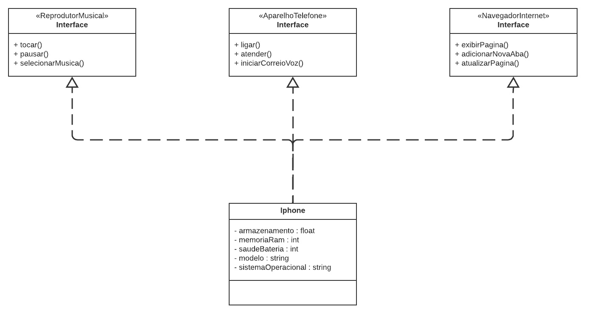

# 📱 Modelagem UML e Código do Componente iPhone

## Representação UML 📝

A diagramação foi inspirada no vídeo de lançamento do iPhone, utilizando a ferramenta de UML **Lucidchart**. 
A proposta é representar, por meio de interfaces e classes, os papéis do iPhone como **Reprodutor Musical**, 
**Aparelho Telefônico** e **Navegador de Internet**. Inicialmente, busquei abstrair ao máximo o modelo real, 
facilitando o entendimento ao simplificar o código e destacando a importância da modelagem UML para o planejamento 
e a programação orientada a objetos.

 

## Sugestões 🤝

💡 O repositório está aberto a críticas construtivas e sugestões de melhorias!

---

🔗 **Lucidchart**: [Ferramenta de UML](https://www.lucidchart.com)
